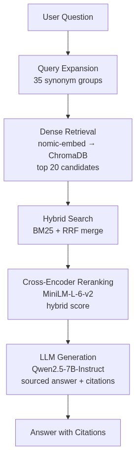

# Blog Post Draft — "Building a Multi-Sector RAG Pipeline with 74% Faithfulness"

## Metadata

| Field | Value |
|-------|-------|
| **Title** | Building a Multi-Sector RAG Pipeline with 74% Faithfulness |
| **Subtitle** | From 3 Restaurant Chains to 7 Companies Across 4 Sectors — What I Learned |
| **Platform** | Medium + dev.to |
| **Audience** | ML engineers, data scientists, finance AI practitioners |
| **Est. read time** | 8-10 minutes |

---

## Draft

### Hook

> "71% of the errors in my financial RAG system came from one source: the LLM couldn't tell which fiscal year a number belonged to."

That was the finding from a cross-validation study where I had Claude evaluate every claim my pipeline generated. The LLM's self-score was 65.8% — but Claude found only 59.7% were truly faithful. The model was overconfident, and nearly 1 in 3 claims was wrong or misleading.

The culprit? Correctly retrieved numbers attached to the wrong time period. Fixing that single error class was the difference between a demo and a portfolio project.

### The Error That Changed Everything

I built a RAG system to answer financial questions from SEC filings — specifically Management's Discussion & Analysis (MD&A) sections. The goal: turn a 4-hour manual variance analysis into a 3-minute query with traceable sources.

I ran a systematic error classification using Claude. Three patterns emerged:

| Error Mode | Frequency | Example |
|------------|-----------|---------|
| **Period Cross-Contamination** | 71% | Source says "FY2024 revenue = $10B, FY2023 = $9B" → LLM answers "revenue increased to $10B in FY2023" |
| **Metric Conflation** | 12% | Source says "comparable store sales +5%" → LLM answers "total revenue +5%" (correct number, wrong label) |
| **Number Transposition** | 8% | Source says "0.6%" → LLM answers "6%" |

The most surprising finding: **71% of errors weren't about hallucination or missing data**. They were about correctly retrieved numbers attached to the wrong time period. The LLM saw "revenue $10B" and "FY2024" in the same context window, but couldn't reliably pair them.

### The Fix: 4 Prompt Rules — Plus Retrieval, Plus a Model Swap

Prompting alone wasn't enough. The journey involved three layers of fixes:

**Layer 1 — Prompt rules (period integrity, exact metric names, verify direction, use what you have).**

These 4 rules formed the backbone of the system prompt:

```
1. EXACT METRIC NAMES: "comparable store sales" ≠ "total revenue"
2. PERIOD INTEGRITY: Every number must cite its fiscal period.
3. VERIFY DIRECTION: If source says "increased from 25% to 26%",
   don't write "decreased to 25%".
4. USE WHAT YOU HAVE: If data is missing, say so — don't fill gaps.
```

**Layer 2 — Retrieval fixes.** The cross-encoder re-ranker added **+0.28 recall@10**, the single biggest retrieval gain. The forward-looking penalty had zero impact on aggregate metrics but fixed specific edge cases where risk-factor chunks drowned out MD&A content.

**Layer 3 — Model swap.** The original pipeline used `Qwen2.5-VL-7B` — a vision variant that wastes parameter budget on image encoders. Swapping to `Qwen2.5-7B-Instruct` (text-only) added **+4.5pp faithfulness**, unlocking the full 7B capacity for text reasoning.


*Left to right: baseline (Iterasi 6), after Phase 1 metric fixes (Iterasi 9), after model swap (Iterasi 9.5). Cross-sector evaluation (40 questions, 7 companies) at far right.*

### Architecture & Ablation

The pipeline evolved through systematic ablation — each component added and measured independently:



**Ablation results (40 questions, 7 companies):**

| Pipeline | recall@10 | MRR | Delta recall@10 |
|----------|-----------|-----|-----------------|
| Baseline (dense only) | 0.51 | 0.272 | — |
| + Query Expansion | 0.45 | 0.330 | -0.06 |
| + Hybrid (BM25 + RRF) | 0.47 | 0.347 | +0.02 |
| **+ Cross-Encoder** | **0.75** | **0.486** | **+0.28** |
| + Index rebuild (chunk fix) | **0.81** | **0.540** | +0.06 |
| **Full Pipeline** | **0.81** | **0.540** | — |

The cross-encoder was the dominant component — recall@10 jumped from 0.47 → 0.75 (**+0.28**). It lifted recall@1 from **0.14 → 0.23 (+64%)**. Cases like "CMG G&A expenses" went from rank 17 to rank 1. Four evaluation questions that previously returned zero relevant chunks were fully recovered.

**End-to-end faithfulness progression (restaurant, 20 questions):**

| Phase | Intervention | Strict |
|-------|-------------|--------|
| Baseline (Iterasi 6) | After initial prompt fixes | 65.8% |
| Phase 1 (Iterasi 9) | Metric conflation + number transposition + causal proximity fixes | 69.6% |
| Phase 7e (Iterasi 9.5) | Model swap VL→non-VL + all above | **74.24%** |
| **Total improvement** | | **+8.44pp** |

The pipeline is now consumable through 4 surfaces:

| Surface | Tech | Usage |
|---------|------|-------|
| **Streamlit UI** | `app.py` | Visual dashboard |
| **MCP Server** | FastMCP | Claude Code, Cursor, Cline |
| **REST API** | FastAPI + Swagger | `curl`, any HTTP client |
| **Agent Skills** | opencode skill | AI coding agents |

Every error path is covered — retry with backoff, timeout (120s), input validation, rate limiting, graceful component degradation. All verified with **47 unit tests**, ruff (0), mypy (0), bandit (0).

### From 3 Restaurants to 4 Sectors

The original pipeline covered 3 restaurant chains (CMG, DRI, CBRL). The stress test: add Walmart and Target (retail), Johnson & Johnson (healthcare), ExxonMobil (energy) — **56 filings, 1079 chunks**.

Midway through, I hit a wall: recall@10 stuck at **0.75** with 4 questions returning zero relevant chunks. Root cause: **chunk boundary drift**. Each index rebuild shifted chunk IDs in ChromaDB — evaluation questions pointed at stale golden IDs. Fix: rebuilt the 4 stale mappings.

**Final results:**

| Metric | Restaurant | Cross-Sector |
|--------|-----------|--------------|
| recall@10 | 0.85 | 0.81 |
| MRR | 0.58 | 0.54 |
| Faithfulness (strict) | **74.24%** | **59.29%** |
| Faithfulness (weighted) | **75.32%** | **73.45%** |

Retail recall held at **1.00** for both WMT and TGT — zero degradation. Faithfulness dropped from 74% to 59% on cross-sector questions, reflecting the 7B model's ceiling with diverse industry terminology. The weighted score (73.45%) shows partial answers were often reasonable — the model got direction and magnitude right even when specific numbers mismatched.

Key architectural decisions:
- **Local-first**: Qwen2.5-7B entirely on-device via llama.cpp (no API costs, 120s timeout)
- **Swappable backends**: OpenAI and Anthropic drop-in via `.env` toggle
- **Multi-stage retrieval**: dense embedding → BM25 → cross-encoder → verified answer
- **Graceful degradation**: every component can fail independently without crashing the pipeline

### Key Lessons

1. **Classify errors before fixing them.** Period cross-contamination was 71% of errors. If I'd only optimized for overall accuracy, I'd have fixed the wrong thing.

2. **Chunk boundaries are a silent killer.** Every index rebuild can invalidate golden chunk IDs. Build evaluation with chunk-content matching, not ID pinning.

3. **7B models have a faithfulness ceiling.** Cross-sector strict score at 59% reflects real limitations. The weighted score (73%) suggests partial answers are reasonable, but strict accuracy needs larger models or better retrieval.

4. **Ablation proves what works.** Cross-encoder added +0.28 recall — no amount of prompt engineering could replace that. Measure every component independently.

5. **MCP is the new standard for AI tools.** Exposing a RAG pipeline via MCP matters as much as the pipeline itself.

### What's Next

- Benchmark GPT-4o, Claude, Gemini against the local 7B model
- Publish the evaluation dataset on Hugging Face
- Streamable HTTP transport for remote MCP access

### Code & Resources

- GitHub: https://github.com/redsandr/rag-variance-explainer
- Live demo: https://rag-variance-explainer.vercel.app
- MCP config: `python src/server.py` (stdio) or `--sse` (HTTP)

---

## Call to Action

Try it: clone the repo, pick a ticker (CMG for restaurant, WMT for retail, JNJ for healthcare, XOM for energy), and ask "How did revenue change?" The answer comes back with citations from actual SEC filings — **no API key required.**

---

## Pre-Publish Checklist

- [ ] Convert `faithfulness_chart.svg` → PNG (use browser screenshot or cairosvg)
- [ ] Upload `architecture_diagram.png` to Medium/dev.to image CDN (it's a PNG already)
- [ ] Prompt rules code block styling (Medium: surround with ```)
- [ ] Proofread
- [ ] Choose publication date
