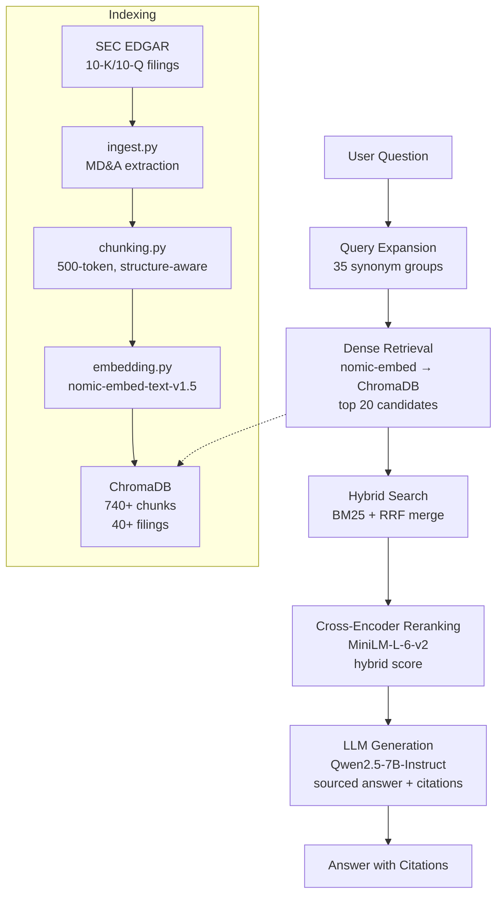

# RAG Variance Explainer

<p align="center">
  <a href="https://python.org"></a>
  <a href="https://img.shields.io/badge/version-1.0.0-violet"></a>
  <a href="https://streamlit.io"></a>
  <a href="https://www.trychroma.com"></a>
  <a href="https://github.com/ggerganov/llama.cpp"></a>
  <a href="LICENSE"></a>
  <a href="https://github.com/redsandr/rag-variance-explainer/actions"></a>
</p>

> **Turn a 4-hour manual variance review into a 3-minute query.** Ask *"why did this financial metric change?"* in plain language and get a sourced, citation-backed answer from real SEC filings — across **7 companies, 4 sectors**, locally, at zero cost per query.

Financial analysts read MD&A sections for hours every quarter. Most RAG demos work on one dataset in one domain — **generalization is the hard part.** This project proves a financial RAG pipeline can generalize across sectors without degrading retrieval quality.

### Why this project exists

I wanted to answer a specific question: *Can a fully local RAG pipeline maintain high retrieval accuracy across multiple financial sectors without per-sector fine-tuning?*

Most RAG demos retrieve generic text from one dataset. This project uses real SEC filings (MD&A sections from 10-K/10-Q), real financial queries, and a rigorous evaluation framework to measure whether off-the-shelf components (nomic-embed, cross-encoder, LLM) can generalize across restaurant, retail, healthcare, and energy domains. The answer is yes — with the right architecture and ablation-driven tuning.

> **Full documentation:** [docs/](docs/) — architecture decisions, evaluation iterations, technical notes.
> **Landing page:** [rag-variance-explainer.vercel.app](https://rag-variance-explainer.vercel.app)

---

## Use Cases

| Question | Answer includes | Source |
|----------|----------------|--------|
| *"Why did Chipotle's labor costs change?"* | Wage inflation, CA minimum wage, sales leverage | CMG 10-K/10-Q |
| *"What drove Walmart's e-commerce growth?"* | Omnichannel penetration, store-fulfilled pickup/delivery | WMT 10-K/10-Q |
| *"How did Target's gross margin rate change?"* | Merchandise mix, promotions, shrink impact | TGT 10-K/10-Q |
| *"How did Darden's acquisition of Chuy's impact revenue?"* | Purchase price, sales contribution, segment profit | DRI 10-K/10-Q |
| *"How do WMT and TGT compare on inventory turnover?"* | Cross-retail inventory trends, shrink reduction | WMT + TGT 10-K/10-Q |

---

## Architecture



| Component | Technology | Detail |
|-----------|-----------|--------|
| Embedding | `nomic-embed-text-v1.5` | 768-dim, normalized, search-query/doc prefix |
| Vector store | ChromaDB | Cosine distance, metadata-rich, persistent |
| Re-ranking | `cross-encoder/ms-marco-MiniLM-L-6-v2` | Hybrid CE + bi-encoder scoring |
| Chunking | Structure-aware recursive split | 500-token, paragraph → line → token |
| LLM (default) | `Qwen2.5-7B-Instruct Q4_K.M` | llama.cpp, RTX 5060, ~2-3s/gen |
| Query expansion | Financial glossary | 35 synonym groups across 4 sectors |
| Data source | SEC EDGAR | 10-K/10-Q, MD&A section only |
| Index | **740+ chunks** | 40+ filings, ~2 years per company |

### Benchmark Hardware

| Component | Spec |
|-----------|------|
| GPU | NVIDIA RTX 5060 Laptop (6 GB VRAM) |
| LLM | Qwen2.5-7B-Instruct Q4_K.M GGUF (~4.7 GB) |
| Generator | llama.cpp, ~2-3 seconds per query |
| RAM | 32 GB |
| Storage | SSD |
| OS | Windows 11 |

---

## Results

### Retrieval — Method Benchmark

40 ground-truth questions, 7 companies. Comparison of standalone retrieval methods:

| Method | recall@1 | recall@3 | recall@5 | recall@10 | MRR |
|--------|----------|----------|----------|-----------|-----|
| BM25 Only (keyword) | 0.11 | 0.24 | 0.26 | 0.35 | 0.269 |
| Dense Only (nomic-embed) | 0.06 | 0.18 | 0.29 | 0.51 | 0.272 |
| Hybrid (dense + BM25) | 0.05 | 0.20 | 0.26 | 0.45 | 0.266 |
| Hybrid + Cross-Encoder | 0.19 | 0.46 | 0.60 | 0.72 | 0.459 |
| **Full Pipeline** | **0.23** | **0.49** | **0.65** | **0.75** | **0.486** |

Key findings:
- **BM25 alone fails** on financial text — recall@10=0.35, keyword matching insufficient for nuanced MD&A language
- **Hybrid without expansion hurts** — RRF merge dilutes dense precision when query expansion is off (0.51 → 0.45)
- **Cross-encoder is the largest single contributor** — recall@10 jumps from 0.45 → 0.72 (+0.27)

### Retrieval Recall@k — Ablation Study

Additive component breakdown on the same eval set.

| Pipeline | recall@1 | recall@3 | recall@5 | recall@10 | MRR |
|---|---|---|---|---|---|
| Baseline (dense only) | 0.06 | 0.18 | 0.29 | 0.51 | 0.272 |
| + Query Expansion | 0.09 | 0.27 | 0.36 | 0.45 | 0.330 |
| + Hybrid Search (BM25) | 0.07 | 0.32 | 0.37 | 0.47 | 0.347 |
| **+ Cross-Encoder** | **0.23** | **0.49** | **0.65** | **0.75** | **0.486** |
| + Forward-Looking Penalty | 0.23 | 0.49 | 0.65 | 0.75 | 0.486 |
| **Full Pipeline** | **0.23** | **0.49** | **0.65** | **0.75** | **0.486** |

Key findings:
- **Cross-encoder is the dominant component** — recall@10 jumps from 0.47 → 0.75 (+0.28)
- Query expansion improves MRR but slightly reduces recall@10 — broadened queries find fewer exact chunks
- Forward-looking penalty and keyword boost are zero-impact on aggregate — they fix edge cases (risk-factor chunks) that don't appear in average metrics

### Cross-Sector Generalization

Pipeline tested on retail without any domain-specific tuning:

| Ticker | recall@1 | recall@3 | recall@5 | recall@10 | MRR |
|--------|----------|----------|----------|-----------|-----|
| **WMT** (Walmart) | 0.36 | 0.86 | 1.00 | 1.00 | 0.64 |
| **TGT** (Target) | 0.43 | 0.86 | 1.00 | 1.00 | 0.65 |
| **Cross-retail** (no filter) | 0.33 | 0.75 | 1.00 | 1.00 | 0.65 |

**Zero degradation** — retail recall@10 = 1.00 matches or exceeds restaurant baseline. Architecture is domain-agnostic.

### Hardest-Case Turnaround

| Case | Before | After | Fix |
|---|---|---|---|
| CMG G&A (eval-009) | rank 17, recall@10=0.00 | rank 1, recall@10=0.67 | Cross-encoder re-ranking |
| CBRL labor (eval-017) | rank 17, recall@10=0.00 | rank 1, recall@10=1.00 | Cross-encoder re-ranking |
| DRI marketing (eval-002) | rank 14, recall@10=0.00 | rank 8, recall@10=1.00 | Forward-looking penalty |
| recall@10=0 cases | 4/20 | 0/20 | Combined pipeline |

### Faithfulness (LLM-as-Judge)

| Phase | Model | Strict | Weighted | Δ Strict |
|-------|-------|--------|----------|----------|
| Baseline | Qwen2.5-VL-7B | 65.8% | 78.9% | — |
| Phase 7e (3 fixes + model swap) | Qwen2.5-7B-Instruct | **74.24%** | 75.0% | **+8.44pp** |
| Phase 7f (prompt + parser fix) | Qwen2.5-7B-Instruct | — | **75.32%** | — |

> Weighted baseline (78.9%) and post-fix (75.32%) are not directly comparable — methodology was refined between iterations. **Strict metric is the reliable indicator**: 65.8% → 74.24% (+8.44pp).

Three targeted fixes drove the improvement:
1. **Number transposition** — `verify_answer()` catches decimal shifts & year mismatches
2. **Metric conflation** — `MetricVerifier` cross-checks labels against source metadata
3. **Causal proximity** — `tag_chunk()` metric enrichment filters retrieval

**Methodology:** Qwen2.5-7B-Instruct acts as the judge. Cross-validated against Claude (Anthropic) on 20 questions × 66 claims — no manual human annotation.

---

## Quick Start

### Option A — Local model (llama.cpp, ~4.7 GB)
```bash
# Windows
python -m venv venv && venv\Scripts\activate
# Linux / macOS
python -m venv venv && source venv/bin/activate

pip install -r requirements.txt
cp .env.example .env
# Download Qwen2.5-7B-Instruct-Q4_K_M.gguf → models/
# https://huggingface.co/Qwen/Qwen2.5-7B-Instruct-GGUF
python src/build_index.py
streamlit run app.py
```

### Option B — OpenAI API (no download)
```bash
python -m venv venv && venv\Scripts\activate  # or source venv/bin/activate
pip install -r requirements.txt
cp .env.example .env
```
Set in `.env`:
```
LLM_BACKEND=openai
OPENAI_API_KEY=sk-...
```
```bash
python src/build_index.py
streamlit run app.py
```

### Configuration

All parameters via env vars — no hardcoded magic numbers.

| Variable | Default | Description |
|----------|---------|-------------|
| `LLM_BACKEND` | `llama_cpp` | `llama_cpp`, `anthropic`, or `openai` |
| `RAG_CROSS_ENCODER_ENABLED` | `true` | Enable cross-encoder re-ranking |
| `RAG_CROSS_ENCODER_WEIGHT` | `0.7` | CE vs bi-encoder blend |
| `RAG_TOP_K` | `5` | Final chunks returned to LLM |
| `RAG_EXPANSION_N_TERMS` | `5` | Synonym count per query |
| `RAG_FORWARD_LOOKING_PENALTY_ENABLED` | `true` | Penalize risk-factor chunks |
| `RAG_LLM_MAX_TOKENS` | `2048` | Max generation tokens |
| `RAG_LLM_TEMPERATURE` | `0.1` | Generation temperature |

---

## Features

**Pipeline & Retrieval**
- RAG pipeline: query expansion (35 synonym groups) → ChromaDB retrieval → cross-encoder re-ranking → grounded LLM generation
- Cross-encoder re-ranking (`MiniLM-L-6-v2`) with hybrid scoring and configurable weight blend
- BM25 LRU caching per ticker — 30-50% query latency improvement
- Financial glossary: 35 synonym groups across restaurant, retail, healthcare, energy

**LLM & Resilience**
- Multi-backend: llama.cpp (local GPU, 7B), Anthropic, OpenAI — swappable via `.env`
- Retry (3× exponential backoff), cross-encoder fallback, backend auto-fallback, GPU memory guard
- Prompt injection defense: input sanitization, delimiters, rate limiting (1/10s), instruction guard

**Data & Sectors**
- SEC EDGAR ingestion: auto-fetches MD&A from 10-K/10-Q for 7 companies
- Multi-sector: restaurant, retail, healthcare, energy — sector-aware metadata tagging
- Cross-sector generalization: retail recall@10 = **1.00** — pipeline is domain-agnostic

**Quality & UI**
- Faithfulness evaluation: strict **74.24%**, weighted **75.32%** — LLM-as-judge + Claude cross-validation
- 32 pytest + ruff + mypy CI — strict linting and type checking
- Streamlit dashboard: OLED dark mode, 2 views (Q&A + System Analytics), WCAG contrast

---

## Project Structure

```
├── pyproject.toml             # Package config (pip install -e .)
├── app.py                     # Streamlit dashboard
├── .streamlit/config.toml     # Dark theme config
├── Makefile                   # install / test / run / eval-*
├── tests.py                   # 32 pytest tests (9 modules)
├── .github/workflows/test.yml # CI pipeline
├── docs/                      # Extended documentation
├── src/
│   ├── rag.py                 # RAG orchestrator
│   ├── retrieval.py           # ChromaDB + multi-strategy retrieval
│   ├── cross_encoder.py       # Cross-encoder re-ranking
│   ├── hybrid_search.py       # BM25 + RRF merge
│   ├── query_expansion.py     # Financial synonym expansion (35 groups)
│   ├── llm.py                 # 3-backend LLM client
│   ├── config.py              # Centralized config (22 params)
│   ├── prompts.py             # RAG prompt + judge prompts
│   ├── styles.css             # Dashboard stylesheet
│   ├── logging_config.py      # Shared logging setup
│   ├── ingest.py              # SEC EDGAR fetcher
│   ├── embedding.py           # nomic-embed wrapper
│   ├── chunking.py            # Structure-aware chunking
│   ├── build_index.py         # End-to-end index pipeline
│   ├── eval_ablation.py       # Ablation study runner
│   └── eval_*.py              # Evaluation scripts
└── data/
    ├── eval_questions.json    # 40 ground-truth questions
    ├── llm_outputs.json       # Cached LLM outputs
    └── faithfulness_results.json
```

---

## Roadmap

- [ ] International filings (IFRS-based financials)
- [ ] Multi-turn conversational memory
- [ ] Docker deployment (single-command setup)
- [ ] Fine-tuned embedding model on financial corpus
- [ ] Public hosted demo

---

## Known Limitations

- **Faithfulness ~74% strict** — occasional hallucination on ambiguous multi-period comparisons; cross-validation with Claude shows systematic overestimation addressed in v2
- **Cross-encoder re-ranking** adds ~200ms latency per query
- **SEC EDGAR ingestion** limited to 10-K/10-Q (no 8-K event-driven filings)
- **Single-user** — no session management or multi-tenant support
- **English only** — financial documents and queries in English

---

## CI

GitHub Actions runs `pytest tests.py -v` on every push and PR (Ubuntu, Python 3.11). Also runs `ruff check`, `mypy src/`, `bandit -r src/`.

---

## License

MIT
